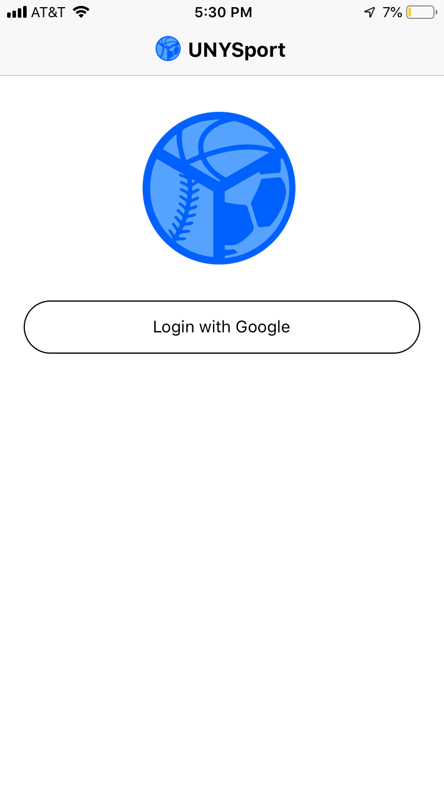
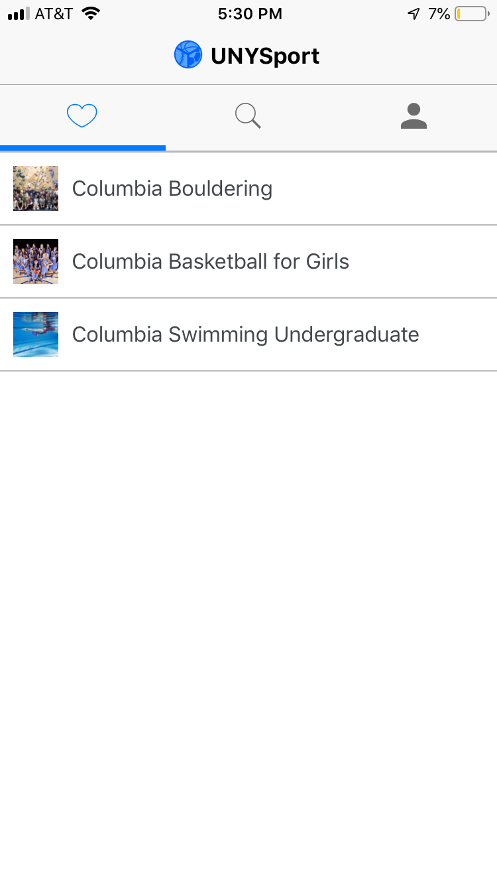
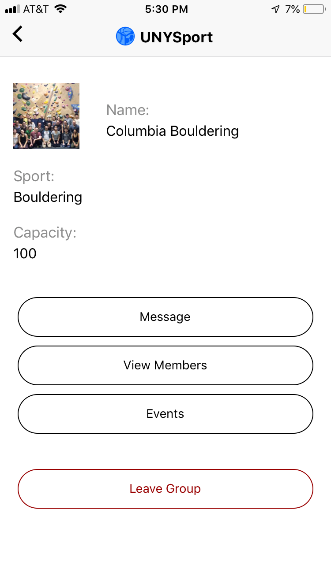
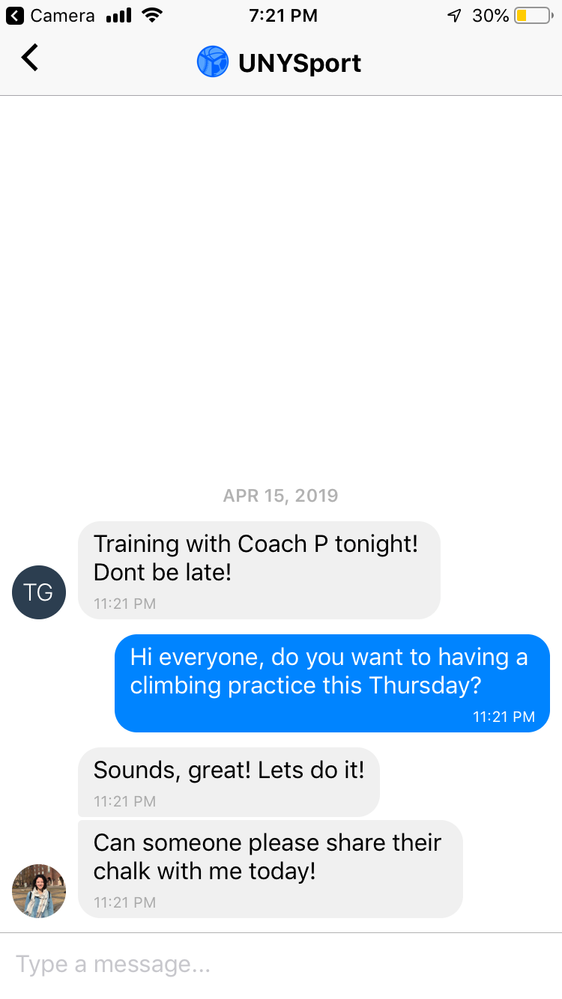
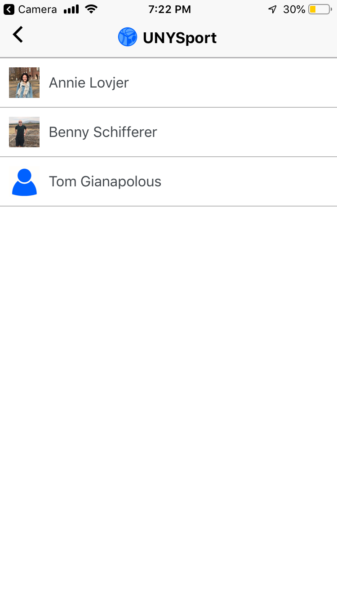
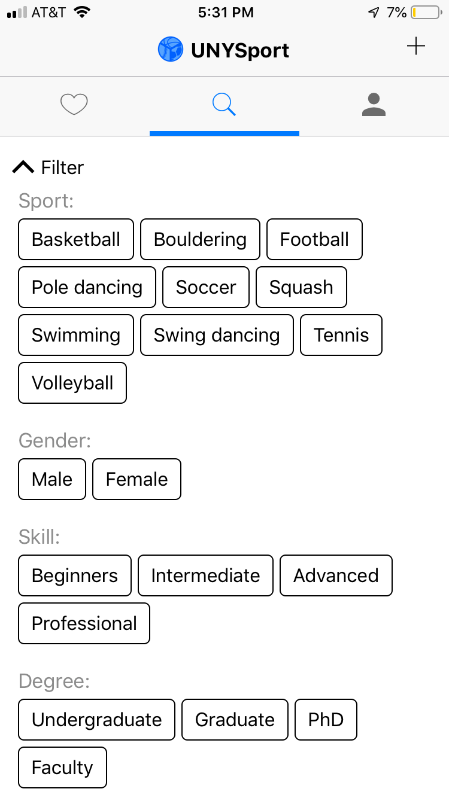
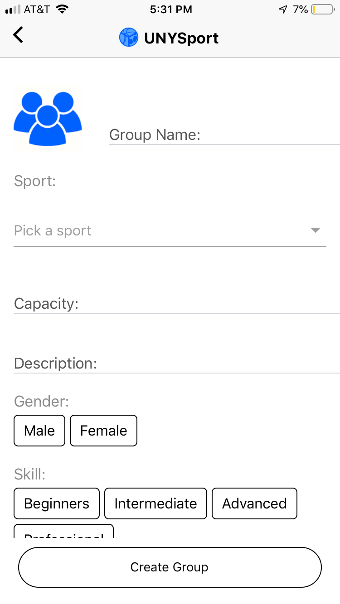
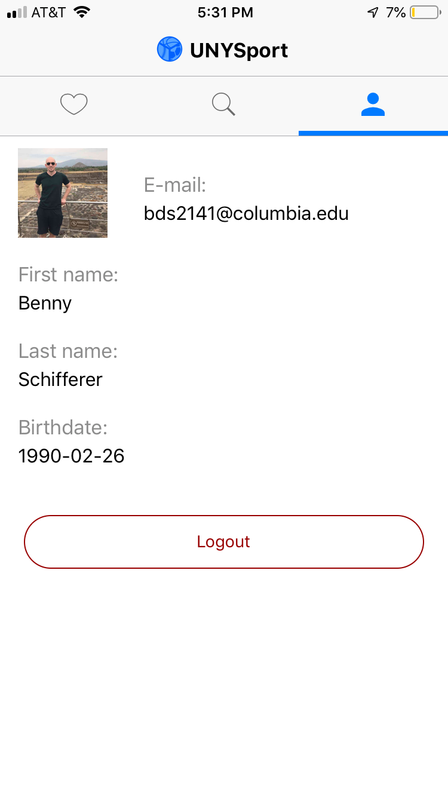

# unysport
UNYSport is a react native app for iOS and Andriod, which helps people to find new sport groups

# Overview
UNYSport supports user to login, create a profile, search/join other sports group or create an own sport group

<nobr>
<nobr>
<nobr>
<nobr>

<nobr>
<nobr>

# How to use
This github repository is structured in 3 folders:
1. 'backend/' contains the python/tornado backend, which communicates with the frontend via restAPIs
2. 'frontend/' contains the react native app
3. 'sqlsample/' contains the create statement for the database incl. some synthetic data
